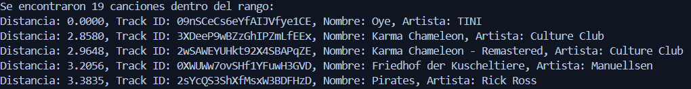

# Proyecto 2 y 3 BD2

# Introducción

### Objetivo General
Desarrollar un sistema integral de búsqueda de canciones que combine consultas textuales mediante un índice invertido y PostgreSQL, además de algoritmos avanzados como KNN Secuencial, R-Tree y FAISS para analizar la similitud musical basada en características acústicas.   

### Objetivos Específicos
1. Implementar un índice invertido para realizar búsquedas eficientes en letras de canciones y compararlo con consultas textuales realizadas en PostgreSQL.  
2. Desarrollar e integrar algoritmos de similitud musical basados en KNN Secuencial, R-Tree y FAISS utilizando características acústicas como vectores MFCC.  
3. Evaluar y comparar el rendimiento del sistema en consultas textuales y análisis de similitud musical, considerando factores como tiempo de respuesta y precisión.  
4. Diseñar experimentos para medir la eficiencia y escalabilidad de las herramientas utilizadas al manejar grandes volúmenes de datos.  
5. Crear una interfaz unificada que permita realizar búsquedas tanto por texto en letras como por similitud en características musicales.  

   
## Descripción de los Datasets  

### Dataset 1: Información General de Canciones de Spotify  

Este dataset contiene información detallada de más de 15,000 canciones de Spotify, ofreciendo una base sólida para el análisis tanto de características musicales como textuales, en sí tiene un total de 14 atributos. Los datos incluyen:  

- **Información básica:** Nombre de la canción, artista, y álbum, proporcionando contexto sobre cada tema musical.  
- **Características de audio:** Atributos como intensidad sonora, tempo, y valencia, entre otros, que permiten realizar análisis de propiedades acústicas.  
- **Letras de las canciones:** Recopiladas a través de la biblioteca Genius en R, proporcionando un recurso textual para análisis semántico o estilístico.  
- **Idioma de las letras:** Detectado utilizando la biblioteca `langdetect` en Python, lo que facilita el estudio lingüístico y cultural de las canciones.  
- **Clasificación por géneros y subgéneros:** Información clave para analizar tendencias y patrones dentro de diferentes estilos musicales.  

El archivo puede consultarse en el siguiente enlace:  [Dataset 1](https://drive.google.com/drive/folders/1mMIidLbl75S0r_4Nlg-9zSHkjrBGog5M?usp=drive_link).  

### Dataset 2: Segmentos de Audio en Formato MP3  

A partir del primer dataset, se generó un segundo conjunto de datos que contiene archivos de audio en formato mp3 para cada canción. Este dataset se diseñó para facilitar el análisis acústico directo, utilizando herramientas de extracción y procesamiento de audio.  

- **Generación de archivos mp3:** Los archivos se descargaron utilizando la biblioteca `stdl`, asegurando una correspondencia directa con las canciones del primer dataset.  
- **Recorte a 30 segundos:** Cada archivo se procesó con `ffmpeg` para recortar un segmento de 30 segundos, proporcionando un tamaño uniforme para el análisis acústico.  

El archivo puede consultarse en el siguiente enlace: [Dataset 2](https://drive.google.com/drive/u/3/folders/1J8RrRfegDamA51AzghoOiHxKvjplVxTM).  


# Backend
### Índice Invertido

### Preprocesamiento

El preprocesamiento es una etapa clave en la creación de un índice invertido para garantizar que los datos textuales sean consistentes y relevantes para las tareas de búsqueda y recuperación. El proceso involucra las siguientes etapas principales:

1. **Tokenización**: 
   - El texto se divide en palabras (tokens) usando la función `nltk.word_tokenize`. Esto asegura que cada palabra pueda procesarse de manera individual.

2. **Normalización y limpieza**: 
   - Se convierten todos los textos a minúsculas para evitar problemas de sensibilidad al caso.
   - Se eliminan los caracteres no alfabéticos y los acentos utilizando `unidecode`, lo que unifica el formato de las palabras.

3. **Eliminación de *Stopwords***: 
   - Se eliminan palabras comunes y poco informativas (como "y", "el", "de") utilizando las listas de *stopwords* en varios idiomas (`english`, `spanish`, `french`, etc.) disponibles en NLTK. Esto reduce el ruido en el índice.

4. **Lematización**: 
   - Las palabras se reducen a su forma base (lematización) mediante `WordNetLemmatizer` para consolidar las variaciones de una misma raíz, como "correr" y "corriendo".

### **Función de Preprocesamiento**

```python
def preprocess_text(text):
    palabras = nltk.word_tokenize(text.lower())
    
    stop_words = set()
    languages = [
        'english',    
        'spanish',    
        'french',     
        'german',     
        'italian',    
        'portuguese', 
        'russian',    
    ]
    for lang in languages:
        stop_words.update(stopwords.words(lang))

    # Filtrar palabras que sean alfabéticas, sin acentos, y que no sean stopwords
    palabras_filtradas = [unidecode(word) for word in palabras if word.isalpha() and unidecode(word) not in stop_words]
    
    # Lemmatizar las palabras filtradas
    lematizador = WordNetLemmatizer()
    palabras_lemmatizadas = [lematizador.lemmatize(word) for word in palabras_filtradas]
    
    return palabras_lemmatizadas
```

El resultado de esta etapa es una lista de términos limpios y normalizados listos para ser indexados.

### SPIMI
La función `spimi_invert` implementa el algoritmo **SPIMI** (*Single-Pass In-Memory Indexing*) para construir índices invertidos de manera eficiente, optimizando el uso de memoria. Este proceso implica dividir los documentos en bloques que se almacenan en memoria secundaria, asegurando que el límite de memoria disponible no se supere. Luego, se realiza un **merge** para combinar los bloques y producir un índice invertido final.

#### Flujo principal:

1. **Construcción del índice invertido por bloques:**  
   - Los términos de cada documento se añaden a un bloque en memoria.
   - Cuando el tamaño del bloque excede un límite predefinido, este se escribe en un archivo JSON en memoria secundaria.
   - Cada bloque incluye una lista de documentos (*posting list*) donde aparece cada término.

2. **Merge de bloques:**  
   - Los bloques creados se combinan en un único índice invertido final.
   - Durante este proceso, se actualizan métricas como la frecuencia de documentos (*df*) y las listas de documentos asociados a cada término.

3. **Cálculo del índice TF-IDF:**  
   - Se calcula el puntaje TF-IDF para cada término y documento utilizando la frecuencia del término (*tf*), frecuencia de documentos (*df*) y el total de documentos (*N*).  
   - Los puntajes TF-IDF se almacenan en un índice separado para facilitar búsquedas eficientes.

4. **Limpieza de bloques temporales:**  
   - Una vez completado el índice invertido y el cálculo de TF-IDF, se eliminan los archivos temporales para liberar espacio en disco.

#### Funciones principales:

- `spimi_invert(documents, block_size_limit)`: Procesa documentos y genera bloques temporales con índices invertidos parciales.
   - Se itera sobre cada documento en la lista documents, asignando un identificador único (doc_id) y procesando el texto mediante una función de preprocesamiento (como preprocess_text).
```python
for doc_id, text in enumerate(documents):
    terms = preprocess_text(text)
```
Cada término se almacena en el diccionario current_block junto con el identificador del documento:
```python
for term in terms:
    current_block[term].append(doc_id)
```
Cuando el tamaño de current_block alcanza el límite especificado (block_size_limit), el bloque se guarda en un archivo JSON dentro de temp_dir.
 ```python
if len(current_block) >= block_size_limit:
    block_filename = f"block_{block_counter}.json"
    block_path = os.path.join(temp_dir, block_filename)
    with open(block_path, 'w', encoding='utf-8') as f:
        json.dump(current_block, f)
```
Si quedan términos en current_block tras procesar todos los documentos, se guarda como un bloque final.
 ```python
if current_block:
    block_filename = f"block_{block_counter}.json"
    block_path = os.path.join(temp_dir, block_filename)
    with open(block_path, 'w', encoding='utf-8') as f:
        json.dump(current_block, f)
```
- `merge_blocks(block_files)`: Combina bloques en un único índice invertido final.
   - El código itera sobre cada archivo en la lista block_files, donde cada archivo representa un bloque de índice invertido.
 ```python
for block_file in block_files:
```
Si el archivo existe, se abre y se carga como un diccionario (block_data) usando json.load y se registran detalles como el nombre del archivo y la cantidad de términos en el bloque.
 ```python
if os.path.exists(block_file):
    with open(block_file, 'r', encoding='utf-8') as f:
        block_data = json.load(f)
        log_merge(f"Procesando bloque: {block_file}")
        log_merge(f" Términos en bloque: {len(block_data)}")
```
Cada término del bloque y su lista de postings se combina en final_index. Esto se logra extendiendo las listas existentes (si el término ya estaba en el índice final) o añadiendo nuevos términos.
 ```python
for term, postings in block_data.items():
    final_index[term].extend(postings)
```
- `calculate_tf_idf(documents, inverted_index)`: Calcula los puntajes TF-IDF para el índice.
- `clean_temp_blocks()`: Elimina los bloques temporales creados durante el proceso.

El índice resultante se utiliza para realizar búsquedas eficientes mediante la similitud de coseno, devolviendo los documentos más relevantes para una consulta dada.

### Experimento (comparación de tiempos PostgreSQL vs Indice Invertido)


# Índices Multidimensionales

## MFFC (Extracción de vectores característicos)
Para representar las características acústicas de las canciones que vamos a indexar, utilizamos **MFCC**. Los MFCC son ampliamente utilizados en el procesamiento de audio, especialmente para tareas como clasificación y recuperación de música, ya que capturan los patrones de frecuencia de la señal de audio en un espacio logarítmico, que es más cercano a cómo percibimos el sonido.

En este proyecto, decidimos utilizar **50 coeficientes MFCC** (usando `n_mfcc=50`) para capturar una representación más detallada y robusta de cada canción. En lugar de promediar los coeficientes a lo largo del tiempo, se calculan descriptores locales para cada frame del audio, lo que permite preservar la información temporal y capturar variaciones espectrales a lo largo de la duración del archivo. Este enfoque mejora la capacidad de identificar similitudes entre canciones considerando su estructura temporal.

```python
def process_file(file_info):
    track_id, folder_path = file_info
    file_path = os.path.join(folder_path, f"{track_id}.mp3")
    row_data = {'mp3': file_path}

    if os.path.exists(file_path):
        try:
            audio_time_series, sampling_rate = librosa.load(file_path, sr=22050)
            mfcc_array = librosa.feature.mfcc(y=audio_time_series, sr=sampling_rate, n_mfcc=50)
            
            # Guardar MFCCs en la fila
            for i, mfcc_frame in enumerate(mfcc_array.T):
                row_data[f"MFCC_frame_{i+1}"] = mfcc_frame.tolist()
        except Exception as e:
            print(f"Error procesando {file_path}: {e}")
    else:
        print(f"Archivo MP3 no encontrado: {file_path}")
    
    return row_data
```

`process_file()`: Esta función se encarga de procesar cada archivo MP3. Primero, obtiene la ruta del archivo y luego carga el audio. Después, calcula los **50 coeficientes MFCC** para cada frame del audio utilizando la librería `librosa`. Cada frame se guarda como un descriptor local en un diccionario, junto con la ruta del archivo MP3. Los descriptores locales permiten indexar y comparar segmentos específicos del audio en lugar de una representación promedio global.

```python
def getLibrosaFeatures(spotify_df):
    folder_path = 'mp3'
    file_info_list = [(spotify_df.iloc[i].track_id, folder_path) for i in range(len(spotify_df))]

    with ThreadPoolExecutor(max_workers=8) as executor:
        librosa_data = list(tqdm(executor.map(process_file, file_info_list), total=len(file_info_list)))

    librosa_df = pd.DataFrame(librosa_data)
    return librosa_df

librosa_features_df = getLibrosaFeatures(music)
```

`getLibrosaFeatures()`: Esta función gestiona el procesamiento de múltiples archivos MP3. Utiliza **ThreadPoolExecutor** para procesar los archivos en paralelo, lo que mejora el rendimiento cuando se tienen muchos archivos para procesar. Al final, los resultados se almacenan en un DataFrame de Pandas, que contiene todos los coeficientes MFCC de cada canción.

## KNN Sequential

El algoritmo implementado utiliza dos enfoques principales para comparar y encontrar canciones similares en una base de datos basada en sus vectores característicos: **KNN Secuencial** y **búsqueda por rango**. Ambos métodos emplean la distancia euclidiana como métrica para determinar la similitud entre las canciones y la consulta proporcionada por el usuario.

La distancia euclidiana se calcula mediante la función `euclidean_distance`, que toma dos vectores como entrada y devuelve la magnitud de la diferencia entre ellos. Esta métrica es fundamental para evaluar la proximidad entre los vectores de características. La cantidad de vectores caracteristicos dependerá de si aplicamos la reducción PCa o si se hace uso de la cantidad de vectores caracteristicos originales (`n=50`).


Y se define con este código:

```python
def euclidean_distance(vector1, vector2):
    return np.linalg.norm(np.array(vector1) - np.array(vector2))
```
El algoritmo **KNN Secuencial** consiste en encontrar las **k** canciones más cercanas al vector de query (el `track_id` de input). Para cada canción en la base de datos, se calcula la distancia euclidiana entre el vector de consulta y el vector de características (`MFCC_Vector` o `Reduced_MFCC` (aplicando PCA)) de la canción. Estas distancias se almacenan en una **cola de prioridad (heap)** para seleccionar las k canciones con menor distancia de manera eficiente. El siguiente código implementa este proceso:  

```python
def knnSeq(query, C, k):
    priority_queue = []

    for track_id, punto_info in C.items():
        vector = punto_info["Reduced_MFCC"]  # Esto cambia si se aplica reducción PCA o no
        distance = euclidean_distance(query, vector)
        # Negativo para mantener un max heap
        heapq.heappush(priority_queue, (-distance, track_id))

        if len(priority_queue) > k:
            heapq.heappop(priority_queue)
    
    return sorted([(abs(distance), track_id) for distance, track_id in priority_queue])
```  

Donde `query` es el vector de características del `track_id` (identificador de la canción) de consulta, `C` es el diccionario que contiene la información de las canciones, y `k` es el número de canciones más cercanas que se desea encontrar.  

El uso de una **cola de prioridad** mejora la eficiencia del algoritmo al limitar el almacenamiento a las k distancias más pequeñas, eliminando automáticamente las distancias mayores durante el proceso. 

Por ejemplo, si aplicamos el algoritmo de `knnSeq` con el `track_id` de `0qYTZCo5Bwh1nsUFGZP3zn`, con un `k = 8`, este viene a ser el resultado:


Los `k = 8` vecinos más cercanos incluyendose a sí mismo.

Por otro lado, la **búsqueda por rango** busca todas las canciones cuya distancia euclidiana con la consulta sea menor o igual a un radio (`radius`) especificado. Esto se utiliza para encontrar un conjunto dinámico de canciones que cumplan con un criterio de proximidad. 

Su código es el siguiente:
```python
def knnRange(query, C, radius):
    results = []
    
    for track_id, punto_info in C.items():
        vector = punto_info["Reduced_MFCC"] #esto cambia si se aplica reducción PCA o no 
        distance = euclidean_distance(query, vector)
        
        if distance <= radius:
            results.append((distance, track_id))
    
    results.sort(key=lambda x: x[0])
    return results
```
Por ejemplo, si aplicamos el algoritmo con el mismo `track_id` anterior (`0qYTZCo5Bwh1nsUFGZP3zn`) con un `radius = 3.7` este es el resultado:


Las canciones que cumplen con el criterio de distancia son añadidas a la lista de resultados, que se ordena por proximidad antes de ser devuelta.

## RTree

El algoritmo implementado utiliza R-tree como estructura de datos para realizar búsquedas eficientes de canciones similares en una base de datos basada en sus vectores característicos.
Se ha probado este algoritmo junto con PCA, ya que R-tree es más propenso a caer en la "maldición de la dimensionalidad", lo que puede ocasionar problemas de rendimiento. La dimensionalidad elegida fue de 15.

Hemos desarrollado dos algoritmos basados en R-tree:

1. **Rtree por K Top:** Encuentra las k canciones más cercanas a la consulta.
2. **Rtree por Rango:** Encuentra todas las canciones dentro de un rango de distancia especificado.

### Construcción del R-tree
Antes de realizar búsquedas, es necesario construir la estructura R-tree a partir de la base de datos. Esto se logra mediante la siguiente función:
```python
def construir_rtree_con_propiedades(C, dimensions=15):
    prop = index.Property()
    prop.dimension = dimensions
    prop.buffering_capacity = 10
    prop.dat_extension = 'dat'
    prop.idx_extension = 'idx'

    idx = index.Index(properties=prop, overwrite=True)
    track_to_id_map = {}

    for i, (track_id, punto_info) in enumerate(C.items()):
        vector = punto_info["Reduced_MFCC"]
        
        bounds = tuple(list(vector) * 2)
        
        idx.insert(i, bounds)
        track_to_id_map[i] = track_id 

    return idx, track_to_id_map

```
**Descripción:**

- Esta función toma como entrada un diccionario C con la información de las canciones (vectores de características) y genera un índice R-tree optimizado.
- También devuelve un mapeo de los índices del R-tree (idx) al track_id original, necesario para realizar consultas posteriores.

----


### Rtree por K Top
El objetivo de esta función es encontrar las k canciones más cercanas al vector de consulta.

```python
def knn_rtree(query, C, idx, track_to_id_map, k):

    search_range = tuple(list(query) * 2)

    results = []

    for item in idx.nearest(search_range, k):
        track_index = item if isinstance(item, int) else item.id
        track_id = track_to_id_map[track_index]     
        vector = C[track_id]["Reduced_MFCC"]
        distance = euclidean_distance(query, vector)
        results.append((distance, track_id))

    results.sort(key=lambda x: x[0])
    return results
```
**Descripción:**

- La función toma como entrada un vector de consulta (query), el índice R-tree (idx), y la cantidad de elementos deseados (k).
- Devuelve una lista de las k canciones más cercanas, ordenadas por distancia.

**Ejemplo de prueba:**

Se probó la función con un track_id de consulta cuyo vector se utilizó como query y k=8.

**Resultado obtenido:**


---

### Rtree por Rango

Este método encuentra todas las canciones que se encuentran dentro de un radio de distancia (radius) especificado.

```python
def range_search_rtree(rtree_index, query_vector, radius):
    min_bounds = [v - radius for v in query_vector]
    max_bounds = [v + radius for v in query_vector]
    
    rect = tuple(min_bounds) + tuple(max_bounds)
    results = list(rtree_index.intersection(rect)) 
    return results

```
**Descripción:**

- A diferencia de la búsqueda por K Top, aquí se define un rectángulo de búsqueda basado en el radio (radius) y el vector de consulta.
- Devuelve todas las canciones cuyos vectores estén dentro del rango definido.

**Ejemplo de prueba:**

Se probó la función con un track_id de consulta y un radio de 4.

**Resultado obtenido:**




### Conclusión
En conclusión, al realizar experimentaciones con los algoritmos basados en R-tree, observamos que los tiempos de ejecución fueron considerablemente menores en comparación con otros métodos empleados. Esto valida la eficiencia de R-tree para búsquedas en grandes bases de datos cuando se utiliza con reducción de dimensionalidad como PCA.


## FAISS
Como tercera técnica utilizamos Faiss, el cuál, es una libreria para la eficiente búsqueda por similitud, más específico, utilizamos Faiss LSH. La razón por la que utilizamos el Faiss LSH, es porque esta técnica esta diseñada para encontrar los k vecinos mas cercanos de manera aproximada, lo que reduce bastante el tiempo de ejecución, comparado con otros índices como el Flat, ádemas, la principal ventaja del LSH es que reduce la complejidad de búsqueda en casos donde los datos están dispersos, ya que, si los datos tuvieran una dimensión mucho más alta, podría no ser tan eficiente debido a la "maldición de la dimensionalidad". 

Faiss LSH trabajó con 2 parametros para inicializar el índice, dimension (la dimensión de los vectores) y nbits, esta última variable hace referencia al performance del índice, ya que, mientras mas bits tenga el índice la búsqueda va a ser mas efectiva, pero el performance irá empeorando. Para una búsqueda mas efectiva utilzamos 256 bits.

Luego recopilamos los vectores reducidos aplicando las función de ReducirPCA() y les asignamos el formato de punto flotante de 32 bit, ya que, Faiss necesita eso para que funcione de manera correcta. Luego la función train(), lo que hace es que prepara las tablas hash necesarias para mapear a los vectores de entrada y por último, añade los vectores preparados al índice para poder hacer las consultas por similitud.

```python
n_bits = 4
dimension = 15
index = faiss.IndexLSH(dimension, n_bits)

 mfcc_vectors = np.array([punto["Reduced_MFCC"] for punto in puntos_reducidos.values()]).astype('float32')

index.train(mfcc_vectors)
index.add(mfcc_vectors)
```

La función faiss_lsh recibe 4 parámetros; el track_id que viene a ser la query, k que son la cantidad de elementos similares que devolveremos, puntos que es la data completa, e index que es el índice LSH ya inicializado.
Primero revisa si la data contiene a la query, en caso contrario, retorna nada, ya que, no se encontró. Luego, obtenemos el vector reducido de la query para poder hacer las comparaciones. 

Después, utiliza la función search para poder buscar los k + 1 vectores más cercanos que devuelve distances (Distancia de los vectores mas cercanos de la query al k) e índices (Índice de los vectores más cercanos al k), se utilizó k + 1 porque al realizar la búsqueda puede ser que se encuentre a si mismo, entonces k + 1 retorna lo k valores má cercanos a la query, omitiendo a la query misma.

Similares es una tupla que guarda índices y distancias, que luego filtra el vector de consulta de los resultados asegurándose de que el índice no coincida con el índice del track_id en el diccionario puntos, para luego traer los k más cercanos.

Por último, divide la tupla en 2 arrays, uno con las distancias filtradas y otro con lo índices filtrados, estos índices sirven para poder recuperar los track_id´s y para luego acceder a la información completa en puntos (como nombre del artista, etc). Retorna la información de la canciones similares con sus distancias, si no se encuentran vecinos retorna listas vacías.

```python
def faiss_lsh(track_id, k, puntos, index):
    if track_id not in puntos:
        return None, None
    
    query_row = puntos[track_id]
    mfcc_query = np.array(query_row["Reduced_MFCC"]).reshape(1, -1)
    
    distances, indices = index.search(mfcc_query, k + 1)
    similares = [(idx, dist) for dist, idx in zip(distances[0], indices[0]) if idx != list(puntos.keys()).index(track_id)]
    
    similares = similares[:k]
    
    if similares:
        filtered_indices, filtered_distances = zip(*similares)
        similar_tracks = [list(puntos.keys())[idx] for idx in filtered_indices]
        similar_info = [puntos[track_id] for track_id in similar_tracks]
        return similar_info, filtered_distances
    else:
        return [], []
```

Esta es un prueba de como es el performance con los diferentes nbits para la creación del índice con una canción de Maluma, Felices los 4: 

N | 4 | 8 | 16 | 32 | 64 | 128 | 256
---|---|---|---|---|---|---|---|
1000 | 33.94 ms | 7.96 ms | 9.75 ms | 12.67 ms | 14.96 ms | 22.18 ms | 76.56 ms
2000 | 7.99 ms | 7.96 ms | 8.97 ms | 9.99 ms | 16.96 ms | 17.00 ms | 51.23 ms
4000 | 7.96 ms | 8.26 ms | 9.00 ms  | 10.00 ms| 11.96 ms | 18.00 ms | 49.97 ms
6000 | 7.96 ms | 8.00 ms | 9.99 ms | 13.00 ms | 13.00 ms | 18.00 ms | 51.67 ms
8000 | 7.96 ms | 7.00 ms | 8.99 ms | 9.96 ms | 12.34 ms | 17.97 ms | 47.98 ms
10000 | 6.97 ms | 7.00 ms | 9.00 ms | 10.96 ms | 11.37 ms | 20.00 ms | 51.00 ms

Se puede notar una diferencia de los tiempos en como van incrementando con respecto a la cantidad de bits, pero tambien existe una diferencia en la precisión, la canción buscada es una de reggaeton y por ejemplo, para los 4 bits nos retorna canciones que seguro tienen el mismo ritmo pero ninguna de reggaeton o español:


En cambio con 256 ya nos salen algunas canciones en español y que si son reggaeton:


## Experimentación 
Usaremos el track_id `09nSCeCs6eYfAIJVfye1CE` para realizar la experimentación con los 3 índices multidimensionales, más 2 búsquedas por rango, y compararlos.

### Aplicando PCA

N | KNN Sequential | KNN Range| RTree |RTree Range | FAISS
---|---|---|---|---|---|
1000 | 44.94 ms | 39.18 ms | 1.00 ms |0.96 ms| 63.02 ms
2000 | 48.14 ms | 46.14 ms | 2.00 ms| 0.00 ms| 35.99 ms
4000 | 51.34 ms | 46.18 ms | 3.00 ms |1.99 ms | 32.00 ms
6000 | 50.12 ms | 42.22 ms | 5.02 ms| 3.05 ms| 30.96 ms 
8000 | 53.66 ms | 47.65 ms | 6.52 ms | 3.48 ms| 29.00 ms
10000 | 46.71 ms | 41.34 ms | 7.00 ms|3.04 ms | 33.00 ms


### Sin PCA
N | KNN Sequential | KNN Range| RTree|RTree Range | FAISS
---|---|---|---|---|---|
1000 | 86.31 ms | 87.92 ms | 0.99 ms| 0.00 ms| 77.00 ms
2000 | 99.70 ms | 95.12 ms | 2.48 ms |0.92 ms | 50.00 ms
4000 | 90.70 ms | 91.37 ms | 4.40 ms| 2.04 ms | 49.97 ms 
6000 | 92.11 ms | 82.47 ms | 9.51 ms |5.60 ms | 51.00 ms
8000 | 87.61 ms | 77.95 ms | 13.51 ms |5.64 ms| 49.00 ms 
10000 | 86.00 ms | 78.90 ms | 16.56 ms|  7.00 ms| 51.00 ms


### Conclusiones de la Experimentación

Durante la experimentación, notamos un cambio  en los tiempos de ejecución y la calidad de los resultados al aplicar **PCA** en comparación con no usarlo, especialmente en los diferentes algoritmos analizados.

Para los algoritmos **KNN Sequential** y **KNN Range**, aplicar PCA resultó en tiempos más rápidos a medida que aumentaba el número de vectores. Esto se debe a que la reducción de dimensionalidad hace que el cálculo de distancias sea más eficiente. Sin embargo, aunque PCA mejora el rendimiento de KNN, este sigue siendo más lento que los otros métodos, especialmente en búsquedas por rango.

En el caso del **RTree**, vimos una mejora significativa al aplicar PCA. Sin esta reducción, el rendimiento del RTree se ve afectado por la **"maldición de la dimensionalidad"** (al igual que KNN), que disminuye su eficiencia conforme crecen las dimensiones de los datos. Al usar **PCA**, los tiempos de ejecución se redujeron considerablemente. También en **RTree Range** se observó una optimización en los tiempos de búsqueda, lo que confirma la utilidad de **PCA** en este tipo de estructuras.

Por el lado del **FAISS**, aunque es eficiente para búsquedas en vectores de alta dimensión, vimos que aplicar PCA ayudó a mejorar aún más los tiempos de ejecución.

Otro punto clave fue que, con PCA, la similitud en los resultados mejoró considerablemente. Al reducir las dimensiones, los tres algoritmos (**KNN**, **RTree** y **FAISS**) mostraron coincidencias en los resultados en aproximadamente un **70% de las búsquedas**, lo que no ocurría sin PCA, lo que refleja una representación más clara de los datos y una mayor consistencia en los patrones detectados.

En conclusión, la implementación de **PCA** no solo reduce tiempos de consulta, especialmente en RTree, sino que también mejora la precisión en las búsquedas, haciendo más eficiente el manejo de datos de alta dimensión.


# Frontend

- Para el frontend se utilizo el framework de Astro con React, ademas para estilizar el ui se utilizó la librería de NextUI la cual nos da tablas, botones, etc con un diseño responsivo y moderno.

- Para las conexiones con el backend se uso typescript para las conexiones con las apis de backend.

- Se uso tambien adicional las librerias de spline para las animaciones.

- Se uso la api de spotify para agrega imagenes y audios a las canciones seguin el id de cada canción que se obtiene de las canciones.
  
## Vista principal

La menu principal se compone de un AppBar que contiene las vistas de cada apartado del proyecto (filtro de busqueda de canciones en base a la letra y a canciones).


## Cabezera 

- Este componente es donde se colocan los filtros para la busqueda en base a que algoritmo queremos usar, la query que vamos a colocar y la cantidad k de canciones o el radio de busqueda, esto va variar dependiendo de que pagina estemos usando tambien.


### Tabla de contenido

Esta parte contiene los resultados de la cabezera, estos se obtienen a travez de las api que conectan el frontend y backend mediante fastapi y typescript.


### Tiempos de resultado

Aca se muestran los tiempos que demoran cada consulta en hacerse, esta data se trae junto a los resultado de la tabla de resultados.


# Autores

|                     **Esteban Vasquez Grados**                   |                                 **Darío Ricardo Nuñes Villacorta**                                 |                       **Yamileth Yarel Rincón Tejada**                     |  **Flavia Ailen Mañuico Quequejana** |   **Maria Fernanda Surco Vergara**  |
|:----------------------------------------------------------------------------------:|:-----------------------------------------------------------------------------------:|:-----------------------------------------------------------------------------------:|:-----------------------------------------------------------------------------------:|:----:|
